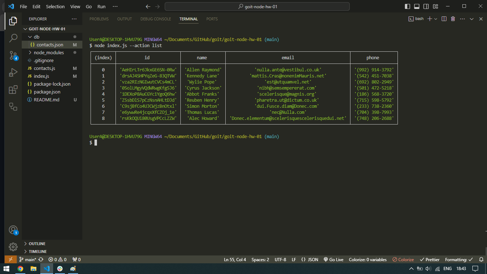
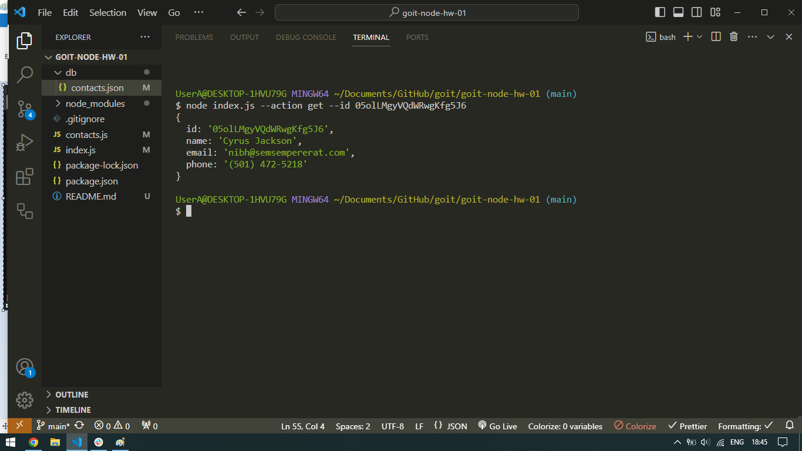
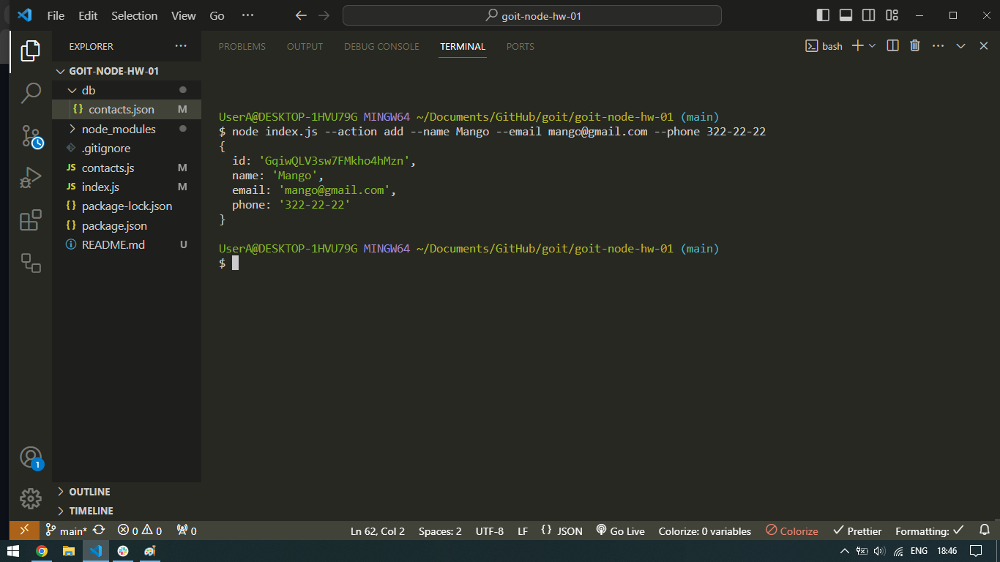
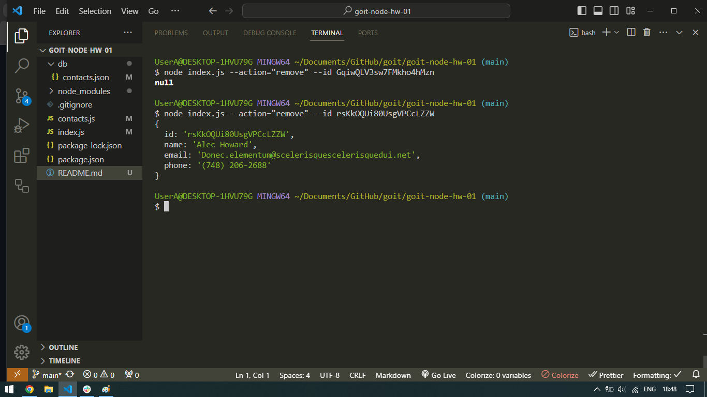

# Отримуємо і виводимо весь список контактів у вигляді таблиці (console.table)

node index.js --action="list"
https://monosnap.com/file/eLT1rEGMkCR76IgygtBPkC09HxXLwe

# Отримуємо контакт по id і виводимо у консоль об'єкт контакта або null якщо контакту з таким id не існує

node index.js --action="get" --id 05olLMgyVQdWRwgKfg5J6
https://monosnap.com/file/pKVlakZ4RV3BNTOfC5Y3FofZhFBBmr

# Додаємо контакт та виводимо в консоль об'єкт новоствореного контакту

node index.js --action="add" --name Mango --email mango@gmail.com --phone 322-22-22
https://monosnap.com/file/pADzMQzTxUmTY6UTNpNIJu9i02mtCR

# Видаляємо контакт та виводимо в консоль об'єкт видаленого контакту або null якщо контакту з таким id не існує

node index.js --action="remove" --id qdggE76Jtbfd9eWJHrssH
https://monosnap.com/file/nPlUVp3NYsZVx4nQ0a5pk76m439PUl

